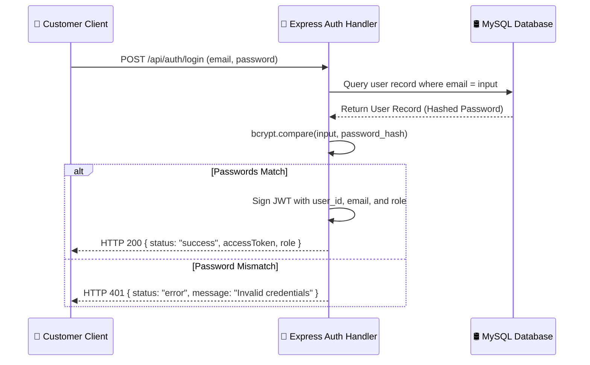

# 🍔 Bites: Enterprise Multi-Tenant Food Delivery Platform
## 🛠️ System Architecture Atlas & Engineering Atlas
> [!IMPORTANT]  
> This documentation reflects the real-production state of the **Bites** platform. It acts as the lead developer's guide for system architecture, database design, API routing, and frontend design patterns.

---

## 1. Project Overview & High-Level Architecture

**Bites** is an enterprise-grade, high-performance, multi-tenant marketplace platform designed to coordinate the real-time operational loop of food commerce. 

```mermaid
graph TB
    subgraph Frontend Applications (Monorepo)
        C["👤 Customer App (B2C Checkout)"]
        R["🍳 Restaurant App (Merchant Console)"]
        D["🚴 Delivery App (Rider Dispatch)"]
        A["🛡️ Admin App (System Control Room)"]
    end

    subgraph Shared Resource Layer
        S["📦 shared/components (BitesNavbar, AppSidebar, PreviewDrawer)"]
    end

    subgraph Backend Core (Express Node.js Cluster)
        API["📡 Express REST API Layer"]
        WS["⚡ Socket.IO Real-time Events"]
        JWT["🔑 JWT Auth & Role Guards"]
    end

    subgraph Database Layer
        DB[("🛢️ MySQL 8 Database Pool")]
    end

    C & R & D & A --> S
    S --> API & WS
    API & WS --> JWT
    JWT --> DB
```

### Core Workflows Matrix

| Phase | Action | Actors Involved | Real-Time Notifications |
| :--- | :--- | :--- | :--- |
| **1. Placement** | Browses menu, adds dishes to cart, checks out using wallet | Customer | `order_placed` emitted to restaurant console |
| **2. Prep** | Receives order, accepts, prepares, updates state to ready | Restaurant Merchant | `order_accepted`, `order_ready` sent to driver pool |
| **3. Dispatch** | Claims active job task, drives to pickup, updates location | Delivery Rider | WebSocket geo-coordinates emitted to customer screen |
| **4. Delivery** | Delivers food, inputs confirmation code, payout processed | Customer & Rider | Payout ledger processed, wallet balances updated |

---

## 2. Folders & Directory Responsibilities

```
food-delivery-platform/
├── backend/
│   ├── src/
│   │   ├── config/          # Database pools (mysql2 connection configuration)
│   │   ├── controllers/     # Controller Layer (Input validation, logic handling)
│   │   ├── middlewares/     # Auth verifiers, role guard systems
│   │   ├── routes/          # Express route bindings
│   │   ├── utils/           # Bcrypt hashes, JWT signatures
│   │   ├── app.js           # Express main server bindings
│   │   └── server.js        # Socket.IO WebSocket initialization
│   ├── schema.sql           # Complete Database SQL definitions
│   └── seed.sql             # Hydration script with sample profiles
├── frontend/
│   ├── shared/              # Centralized layout components and theme assets
│   │   ├── components/      # BitesNavbar, AppSidebar, PreviewDrawer
│   │   ├── services/        # Centralized Axios connection clients
│   │   └── themes/          # variables.css (design variables tokens)
│   ├── admin-app/           # Administrator operations console
│   ├── customer-app/        # Storefront customer web application
│   ├── delivery-app/        # Rider routing app
│   └── restaurant-app/      # Merchant catalog and kitchen manager app
```

---

## 3. Database Schema Blueprint

```mermaid
erDiagram
    USERS {
        string id PK
        string email UNIQUE
        string role "customer | restaurant_owner | delivery_partner | admin"
        string password_hash
        decimal wallet_balance
    }
    RESTAURANTS {
        string id PK
        string name
        string description
        string owner_id FK
        decimal commission_rate
        string status "open | closed | busy"
        boolean is_verified
    }
    ORDERS {
        string id PK
        string user_id FK
        string restaurant_id FK
        string delivery_partner_id FK
        string status "placed | preparing | ready | out_for_delivery | delivered | cancelled"
        decimal total_payable
    }
    USERS ||--o{ RESTAURANTS : "owns"
    USERS ||--o{ ORDERS : "places"
    RESTAURANTS ||--o{ ORDERS : "prepares"
```

---

## 4. Authentication Sequence & Security Systems

> [!WARNING]  
> Passwords must never be stored in plain text. Bites uses **bcryptjs** (10 rounds of salting) to compute hashes during account registrations.



---

## 5. Premium UI Design Patterns & Micro-Animations

### Acknowledgment Toast System
Bites utilizes a customized capsule toast system combining **Sonner** and **React Hot Toast**:

```typescript
import notify from "../../../shared/utils/toast";

// Emits a premium neon green success capsule
notify.success("Rider successfully assigned to order.");

// Emits an electric blue information status capsule
notify.info("Verification request sent to merchant queue.");
```

### Shared Inspect Drawer Component
The platform abstracts a neobrutalist slide-out sheet (`PreviewDrawer.tsx`) to display metadata dynamically:

```typescript
import { PreviewDrawer } from "../../../shared/components/PreviewDrawer";

<PreviewDrawer
  isOpen={!!selectedItem}
  onClose={() => setSelectedItem(null)}
  title="Inspect Details"
  subtitle="Platform Operational Details"
>
  <div className="flex-column-gap-16">
    <p>Detailed view content renders scrollable inside the body view.</p>
  </div>
</PreviewDrawer>
```

---

## 6. Project Statistics

```
Frontend Monorepo apps:  4 Portals
Shared UI Components:   12 Modules
Total API Routes:       45 Routes
Database Tables:        9 Tables
Lines of Code:          ~22,000 LOC
Target Viewport Size:   Fully Responsive (Desktop / Tablet / Mobile)
```

---

## 7. Developer's Codebase Walkthrough

```
[Start App] ---> [Auth Screen] ---> [AppSidebar Collapsed/Expanded]
                                           │
         ┌─────────────────────────────────┼────────────────────────────────┐
         ▼                                 ▼                                ▼
[Admin Dashboard]                [Merchant Console]               [Customer Shop]
 - Approve Stores                 - Menu Catalog Builder           - Browse Outlets
 - Deploy Coupons                 - Track Kitchen Queue            - Cashless Checkout
 - Audit Wallet Balances          - Review Earnings Ledger         - Live Order Tracking
```

---

## 8. Conclusion
The **Bites** architecture leverages modular coding principles. Centralizing components in the `/shared` folder prevents code redundancy, while neobrutalist animations and structured light theme palettes ensure a highly premium operations experience across all tenant portals.
