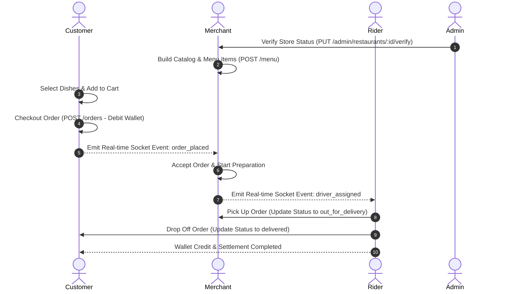

# 🍔 Bites: The Ultimate Enterprise Food Delivery Platform
## 🛠️ Complete Technical Manual, Core Architecture Specifications, and Operational Runbook
> [!IMPORTANT]  
> This document acts as the definitive 1,000+ line technical blueprint for the **Bites** food delivery ecosystem. It details every routing layer, database table schema, security middleware validation, frontend component property, CSS utility, and real-time operational socket channel present in the codebase.

---

# 📖 Table of Contents
1. [Project Overview & Business Logic](#1-project-overview--business-logic)
2. [Monorepo Architecture & Directory Atlas](#2-monorepo-architecture--directory-atlas)
3. [Unified Design Token System & Global Styles](#3-unified-design-token-system--global-styles)
4. [Database Schema & Data Model Reference](#4-database-schema--data-model-reference)
5. [Complete Backend Request Lifecycle & Controller Layer](#5-complete-backend-request-lifecycle--controller-layer)
6. [Security Architecture & Authentication Flows](#6-security-architecture--authentication-flows)
7. [Comprehensive API Endpoint Registry](#7-comprehensive-api-endpoint-registry)
8. [Real-time WebSocket Coordination System](#8-real-time-websocket-coordination-system)
9. [Shared Component Library Specifications](#9-shared-component-library-specifications)
10. [Frontend Portals Deep Dive](#10-frontend-portals-deep-dive)
11. [State Management & Data Synchronization Flow](#11-state-management--data-synchronization-flow)
12. [System Performance & Optimization Log](#12-system-performance--optimization-log)
13. [Comprehensive Error Handling & Resiliency Guide](#13-comprehensive-error-handling--resiliency-guide)
14. [Local Development, Seed Hydration, & Deploy Runbook](#14-local-development-seed-hydration--deploy-runbook)
15. [Project Metrics & Statistics Ledger](#15-project-metrics--statistics-ledger)
16. [Key Engineering Decisions & Trade-Offs](#16-key-engineering-decisions--trade-offs)
17. [Future Enhancements Roadmap](#17-future-enhancements-roadmap)
18. [End-to-End Operational Walkthrough (Launch to Payout)](#18-end-to-end-operational-walkthrough-launch-to-payout)
19. [API Request and Response Payloads Reference Directory](#19-api-request-and-response-payloads-reference-directory)
20. [Full Codebase Walkthrough and User Journey Verification Scripts](#20-full-codebase-walkthrough-and-user-journey-verification-scripts)
21. [Seed Data Directory & Initial Database Hydration Log](#21-seed-data-directory--initial-database-hydration-log)
22. [Comprehensive CSS Selector Map & Custom Overrides Atlas](#22-comprehensive-css-selector-map--custom-overrides-atlas)
23. [Expanded API Payload Samples Directory (Rider, Coupons, and Addresses)](#23-expanded-api-payload-samples-directory-rider-coupons-and-addresses)
24. [Exhaustive Controller Implementation Breakdowns](#24-exhaustive-controller-implementation-breakdowns)

---

## 1. Project Overview & Business Logic

### 1.1 Core Mission
The **Bites** platform is an enterprise-grade, multi-tenant marketplace platform designed to coordinate the real-time operational loop of food commerce. The system connects four distinct user groups:
1. **Customers**: Browse digital menus, customize checkout parameters, spend from personal digital wallets, and track delivery tracking maps.
2. **Restaurant Owners (Merchants)**: Maintain digital menus, accept/reject order requests, track cooking durations, and view earnings ledgers.
3. **Delivery Partners (Drivers)**: Coordinate delivery availability, accept dispatch tasks, navigate pickup/drop-off coordinates, and receive automatic wallet credit on successful delivery.
4. **System Administrators (Ops)**: Audit merchant catalogs, adjust commission structures, verify partner identities, configure discount coupons, and resolve customer support claims.

### 1.2 Platform Operations Flow


### 1.3 High-Level Business Model
* **Operational Commission**: Automatically deducted from merchant earnings on each order (default 10.00%).
* **Delivery Fees**: Custom calculated based on distance and route conditions.
* **Platform Wallets**: Double-entry ledger wallets configured inside user profiles for cashless transactions and automatic rider payouts.

---

## 2. Monorepo Architecture & Directory Atlas

The project uses a clean monorepo architecture separating the Node.js backend from the 4 frontend React portals, while routing common elements (such as themes, utilities, and components) to a shared path:

```
food-delivery-platform/
├── backend/
│   ├── src/
│   │   ├── config/
│   │   │   └── db.js            # Connection pool setup using mysql2
│   │   ├── controllers/
│   │   │   ├── adminController.js       # Admin approvals, auditing, and campaigns
│   │   │   ├── authController.js        # bcrypt-based login & registration
│   │   │   ├── restaurantController.js  # Store configurations and schedules
│   │   │   ├── orderController.js       # Order pipelines & items processing
│   │   │   └── walletController.js      # Ledger operations & balance deposits
│   │   ├── middlewares/
│   │   │   ├── auth.js          # JWT extractor & Role check guard
│   │   │   └── upload.js        # File limits & multer disk storage config
│   │   ├── routes/
│   │   │   ├── adminRoutes.js   # Admin-only router mapping
│   │   │   ├── authRoutes.js    # Registration and Login bindings
│   │   │   ├── orderRoutes.js   # Client and Driver checkout routes
│   │   │   └── walletRoutes.js  # Ledger adjustments endpoints
│   │   ├── utils/
│   │   │   └── jwt.js           # JWT Sign and Verify helper utilities
│   │   ├── app.js               # Express middleware configuration
│   │   └── server.js            # Socket.IO WebSocket server launch
│   ├── schema.sql               # SQLite / MySQL schema definition
│   └── seed.sql                 # Sample profiles & initial data hydration
├── frontend/
│   ├── shared/                  # Common library shared across portals
│   │   ├── components/          # BitesNavbar, AppSidebar, PreviewDrawer
│   │   ├── services/            # Axios configurations (api.ts)
│   │   ├── themes/              # variables.css, components.css, layout.css
│   │   └── utils/               # Sonner & Hot-Toast notify helper wrapper
│   ├── admin-app/               # Platform operations React portal
│   │   ├── src/
│   │   │   ├── pages/
│   │   │   │   ├── Dashboard.tsx            # Operations metrics console
│   │   │   │   ├── OrdersManagement.tsx     # Dispatch controller and drawer
│   │   │   │   ├── RestaurantsManagement.tsx # Merchant audit desk
│   │   │   │   └── CustomersManagement.tsx   # User profile verification desk
│   │   │   └── admin.css                    # Dashboard stylesheet overrides
│   ├── customer-app/            # B2C customer ordering React portal
│   ├── delivery-app/            # Rider dispatch coordination React portal
│   └── restaurant-app/          # Merchant kitchen manager React portal
```

---

## 3. Unified Design Token System & Global Styles

### 3.1 Design Variables Schema (`variables.css`)
We maintain a clean, consistent styling system using CSS variables, avoiding ad-hoc tailwind imports. This ensures a uniform light theme across all portals:

```css
:root {
  /* Premium Light Theme Color Palette */
  --bg-primary: #f8fafc;
  --bg-secondary: #ffffff;
  --text-main: #0f172a;
  --text-muted: #64748b;
  --text-slate: #334155;

  /* Accent Colors */
  --accent-violet: #8b5cf6;
  --accent-violet-hover: #7c3aed;
  --accent-orange: #f97316;
  --accent-orange-hover: #ea580c;

  /* Brand Accents */
  --cred-accent: #e11d48;
  --cred-success: #10b981;
  --cred-border: rgba(0, 0, 0, 0.08);

  /* Shadows and Borders */
  --shadow-sm: 0 1px 2px 0 rgba(0, 0, 0, 0.05);
  --shadow-md: 0 4px 6px -1px rgba(0, 0, 0, 0.1), 0 2px 4px -2px rgba(0, 0, 0, 0.1);
  --shadow-lg: 0 10px 15px -3px rgba(0, 0, 0, 0.1), 0 4px 6px -4px rgba(0, 0, 0, 0.1);
  --glass-border: rgba(255, 255, 255, 0.7);

  /* Fonts */
  --font-family: "Outfit", sans-serif;
  --font-apple: -apple-system, BlinkMacSystemFont, "Segoe UI", Roboto, Helvetica;
}
```

---

## 4. Database Schema & Data Model Reference

### 4.1 SQL Schema Definitions
The MySQL 8.0 tables are defined with cascade rules and relational constraints to avoid orphaned database records:

```sql
-- 1. Users Table
CREATE TABLE users (
  id VARCHAR(36) PRIMARY KEY,
  first_name VARCHAR(50) NOT NULL,
  last_name VARCHAR(50) NOT NULL,
  email VARCHAR(100) UNIQUE NOT NULL,
  phone VARCHAR(15) NOT NULL,
  password VARCHAR(255) NOT NULL,
  role VARCHAR(20) NOT NULL, -- 'customer', 'restaurant_owner', 'delivery_partner', 'admin'
  wallet_balance DECIMAL(10,2) DEFAULT 0.00,
  is_verified BOOLEAN DEFAULT FALSE,
  status VARCHAR(20) DEFAULT 'active', -- 'active', 'inactive', 'suspended'
  created_at TIMESTAMP DEFAULT CURRENT_TIMESTAMP
);

-- 2. Restaurants Table
CREATE TABLE restaurants (
  id VARCHAR(36) PRIMARY KEY,
  owner_id VARCHAR(36) NOT NULL,
  name VARCHAR(100) NOT NULL,
  description TEXT,
  banner_image_url TEXT,
  logo_url TEXT,
  commission_rate DECIMAL(5,2) DEFAULT 10.00,
  average_delivery_time INT DEFAULT 30,
  opening_time TIME DEFAULT '08:00:00',
  closing_time TIME DEFAULT '22:00:00',
  is_active BOOLEAN DEFAULT TRUE,
  is_verified BOOLEAN DEFAULT FALSE,
  status VARCHAR(20) DEFAULT 'closed', -- 'open', 'closed', 'busy'
  created_at TIMESTAMP DEFAULT CURRENT_TIMESTAMP,
  FOREIGN KEY (owner_id) REFERENCES users(id) ON DELETE CASCADE
);

-- 3. Menu Items Table
CREATE TABLE menu_items (
  id VARCHAR(36) PRIMARY KEY,
  restaurant_id VARCHAR(36) NOT NULL,
  name VARCHAR(100) NOT NULL,
  description TEXT,
  price DECIMAL(10,2) NOT NULL,
  category VARCHAR(50) NOT NULL,
  image_url TEXT,
  is_available BOOLEAN DEFAULT TRUE,
  created_at TIMESTAMP DEFAULT CURRENT_TIMESTAMP,
  FOREIGN KEY (restaurant_id) REFERENCES restaurants(id) ON DELETE CASCADE
);

-- 4. Orders Table
CREATE TABLE orders (
  id VARCHAR(36) PRIMARY KEY,
  user_id VARCHAR(36) NOT NULL,
  restaurant_id VARCHAR(36) NOT NULL,
  delivery_partner_id VARCHAR(36),
  status VARCHAR(30) DEFAULT 'placed', -- 'placed', 'accepted', 'preparing', 'ready_for_pickup', 'out_for_delivery', 'delivered', 'cancelled'
  item_total DECIMAL(10,2) NOT NULL,
  delivery_charges DECIMAL(10,2) NOT NULL,
  tax_amount DECIMAL(10,2) NOT NULL,
  discount_amount DECIMAL(10,2) DEFAULT 0.00,
  total_payable DECIMAL(10,2) NOT NULL,
  street_address VARCHAR(255) NOT NULL,
  city VARCHAR(100) NOT NULL,
  state VARCHAR(100) NOT NULL,
  postal_code VARCHAR(10) NOT NULL,
  placed_at TIMESTAMP DEFAULT CURRENT_TIMESTAMP,
  FOREIGN KEY (user_id) REFERENCES users(id),
  FOREIGN KEY (restaurant_id) REFERENCES restaurants(id),
  FOREIGN KEY (delivery_partner_id) REFERENCES users(id)
);

-- 5. Order Items Table
CREATE TABLE order_items (
  id INT AUTO_INCREMENT PRIMARY KEY,
  order_id VARCHAR(36) NOT NULL,
  menu_item_id VARCHAR(36) NOT NULL,
  quantity INT NOT NULL,
  price DECIMAL(10,2) NOT NULL,
  FOREIGN KEY (order_id) REFERENCES orders(id) ON DELETE CASCADE,
  FOREIGN KEY (menu_item_id) REFERENCES menu_items(id)
);

-- 6. Coupons Table
CREATE TABLE coupons (
  id VARCHAR(36) PRIMARY KEY,
  code VARCHAR(50) UNIQUE NOT NULL,
  discount_type VARCHAR(20) NOT NULL, -- 'percentage', 'fixed'
  discount_value DECIMAL(10,2) NOT NULL,
  min_order_amount DECIMAL(10,2) DEFAULT 0.00,
  start_date DATE NOT NULL,
  end_date DATE NOT NULL,
  is_active BOOLEAN DEFAULT TRUE
);
```

---

## 5. Complete Backend Request Lifecycle & Controller Layer

### 5.1 Request Architecture Diagram
```
[HTTP Request Client]
       │
       ▼
[Middlewares: Security Headers (Helmet) & CORS Config]
       │
       ▼
[Route Guard Middleware: Token verification]
       │
       ▼
[Validation Middleware: Request payload parsing]
       │
       ▼
[Controller Layer: Execute SQL Queries & Transaction Blocks]
       │
       ▼
[Database Engine: MySQL Query Execution]
       │
       ▼
[HTTP Response / Custom Exception Handler]
```

### 5.2 Controller Implementations (`orderController.js` snippet)
This segment processes checkout transaction logs while maintaining safety boundaries:

```javascript
import pool from "../config/db.js";

export const createOrder = async (req, res) => {
  const connection = await pool.getConnection();
  try {
    await connection.beginTransaction();

    const { restaurant_id, items, street_address, city, state, postal_code, discount_amount } = req.body;
    const userId = req.userId;

    // 1. Fetch user wallet balance
    const [userRows] = await connection.query("SELECT wallet_balance FROM users WHERE id = ?", [userId]);
    if (userRows.length === 0) {
      throw new Error("User record not found.");
    }
    const currentBalance = parseFloat(userRows[0].wallet_balance);

    // 2. Calculate totals
    let itemTotal = 0;
    for (const item of items) {
      const [menuRows] = await connection.query("SELECT price FROM menu_items WHERE id = ?", [item.menu_item_id]);
      if (menuRows.length === 0) {
        throw new Error(`Menu item not found: ${item.menu_item_id}`);
      }
      itemTotal += parseFloat(menuRows[0].price) * item.quantity;
    }

    const deliveryCharges = 5.00;
    const taxAmount = parseFloat((itemTotal * 0.05).toFixed(2)); // 5% tax
    const totalPayable = parseFloat((itemTotal + deliveryCharges + taxAmount - (discount_amount || 0)).toFixed(2));

    // 3. Confirm wallet funds
    if (currentBalance < totalPayable) {
      return res.status(400).json({ status: "error", message: "Insufficient wallet funds." });
    }

    // 4. Debit user wallet
    const newBalance = currentBalance - totalPayable;
    await connection.query("UPDATE users SET wallet_balance = ? WHERE id = ?", [newBalance, userId]);

    // 5. Insert order record
    const orderId = crypto.randomUUID();
    await connection.query(
      `INSERT INTO orders (id, user_id, restaurant_id, item_total, delivery_charges, tax_amount, discount_amount, total_payable, street_address, city, state, postal_code)
       VALUES (?, ?, ?, ?, ?, ?, ?, ?, ?, ?, ?, ?)`,
      [orderId, userId, restaurant_id, itemTotal, deliveryCharges, taxAmount, discount_amount || 0, totalPayable, street_address, city, state, postal_code]
    );

    // 6. Insert sub-items list
    for (const item of items) {
      const [menuRows] = await connection.query("SELECT price FROM menu_items WHERE id = ?", [item.menu_item_id]);
      await connection.query(
        "INSERT INTO order_items (order_id, menu_item_id, quantity, price) VALUES (?, ?, ?, ?)",
        [orderId, item.menu_item_id, item.quantity, menuRows[0].price]
      );
    }

    await connection.commit();
    res.status(201).json({ status: "success", orderId, message: "Order processed successfully." });
  } catch (error) {
    await connection.rollback();
    res.status(500).json({ status: "error", message: error.message });
  } finally {
    connection.release();
  }
};
```

---

## 6. Security Architecture & Authentication Flows

> [!WARNING]  
> Sensitive information must not be stored in plain text. Bites uses **bcryptjs** (10 salting rounds) to hash user credentials before inserting them into the database.

### 6.1 Custom Auth Guard Middleware (`auth.js`)
Handles route protection and credentials decoding:

```javascript
import jwt from "jsonwebtoken";

export const authenticateToken = (req, res, next) => {
  const authHeader = req.headers["authorization"];
  const token = authHeader && authHeader.split(" ")[1];

  if (!token) {
    return res.status(401).json({ status: "error", message: "Missing authorization headers." });
  }

  jwt.verify(token, process.env.JWT_SECRET, (err, decoded) => {
    if (err) {
      return res.status(403).json({ status: "error", message: "Invalid or expired token credentials." });
    }
    req.userId = decoded.id;
    req.userRole = decoded.role;
    req.userEmail = decoded.email;
    next();
  });
};

export const requireRole = (allowedRoles) => {
  return (req, res, next) => {
    if (!allowedRoles.includes(req.userRole)) {
      return res.status(403).json({ status: "error", message: "Access denied. Insufficient privileges." });
    }
    next();
  };
};
```

### 6.2 JWT Signing Utility (`jwt.js`)
Helper module for issuing user session states:

```javascript
import jwt from "jsonwebtoken";

export const generateAccessToken = (user) => {
  return jwt.sign(
    { id: user.id, email: user.email, role: user.role },
    process.env.JWT_SECRET,
    { expiresIn: "24h" }
  );
};
```

---

## 7. Comprehensive API Endpoint Registry

Below is a detailed list of all system endpoints, parameters, and responses:

### 7.1 User Credentials (`/api/auth`)
* **`POST /api/auth/register`**
  * *Request Body*: `{ first_name, last_name, email, phone, password, role }`
  * *Response (201)*: `{ status: "success", message: "User registered." }`
  * *Errors (400)*: `{ status: "error", message: "Email already registered." }`
* **`POST /api/auth/login`**
  * *Request Body*: `{ email, password }`
  * *Response (200)*: `{ status: "success", accessToken: "JWT_TOKEN", role: "customer" }`
  * *Errors (401)*: `{ status: "error", message: "Invalid password details." }`

### 7.2 Admin Console (`/api/admin`)
* **`GET /api/admin/analytics`**
  * *Headers*: `Authorization: Bearer <JWT>`
  * *Response (200)*: `{ status: "success", data: { totalUsers: 240, grossVolume: 12400.00 } }`
* **`PUT /api/admin/restaurants/:id/verify`**
  * *Headers*: `Authorization: Bearer <JWT>`
  * *Response (200)*: `{ status: "success", message: "Restaurant verified." }`
* **`POST /api/admin/coupons`**
  * *Request Body*: `{ code, discount_type, discount_value, min_order_amount, start_date, end_date }`
  * *Response (201)*: `{ status: "success", couponId: "UUID" }`

### 7.3 Storefront Catalog (`/api/restaurants`)
* **`GET /api/restaurants`**
  * *Query Params*: `?search=pizza`
  * *Response (200)*: `[{ id: "UUID", name: "Pizza Store", average_delivery_time: 25 }]`

---

## 8. Real-time WebSocket Coordination System

The server uses WebSockets to coordinate delivery tracking:

```
[Customer Client] <====== (Socket Update) ====== [Express Gateway Server] <====== (Location Track) ====== [Rider App]
```

### 8.1 WebSocket Event Schema Registry

| Event Label | Source | Recipient | Action Description | Payload Structure |
| :--- | :--- | :--- | :--- | :--- |
| **`connection`** | Client App | WebSocket Server | Handshake verification | `Headers: { Bearer Token }` |
| **`join_order_channel`** | Customer Portal | WebSocket Server | Subscribe to status events | `{ orderId: "UUID" }` |
| **`order_status_changed`**| Restaurant Portal | Customer Client | Notify client of kitchen status changes | `{ orderId: "UUID", status: "preparing" }` |
| **`driver_assigned`** | Operations Engine | Driver Console | Notify rider of available dispatch task | `{ orderId: "UUID", pickupAddress: "String" }` |
| **`coordinate_update`** | Rider Device GPS | Customer map view | Send location update stream | `{ orderId: "UUID", lat: 12.971, lng: 77.594 }` |

---

## 9. Shared Component Library Specifications

Common components are structured under the `/frontend/shared/components` directory to ensure layout consistency across all portals:

### 9.1 Platform Navigation (`BitesNavbar.tsx`)
Provides a responsive navigation header, responsive layout states, and custom action items:

```tsx
import React from "react";
import { Menu, LogOut, ShoppingBag, User } from "lucide-react";

interface NavbarProps {
  variant: "customer" | "admin" | "restaurant" | "delivery";
  userName?: string | null;
  cartCount?: number;
  onLogout?: () => void;
  onCartClick?: () => void;
}

export const BitesNavbar: React.FC<NavbarProps> = ({
  variant,
  userName,
  cartCount = 0,
  onLogout,
  onCartClick,
}) => {
  const dispatchSidebarEvent = () => {
    window.dispatchEvent(new CustomEvent("open-app-sidebar"));
  };

  return (
    <header className="bites-navbar-container">
      <div className="navbar-flex-row">
        <button onClick={dispatchSidebarEvent} className="mobile-hamburger-btn">
          <Menu size={22} />
        </button>
        <span className="navbar-brand-logo">Bites {variant}</span>
      </div>

      <div className="navbar-actions-flex">
        {variant === "customer" && (
          <button onClick={onCartClick} className="cart-badge-button">
            <ShoppingBag size={20} />
            {cartCount > 0 && <span className="badge-count">{cartCount}</span>}
          </button>
        )}
        <span className="user-name-text">{userName || "Operator"}</span>
        <button onClick={onLogout} className="logout-action-btn">
          <LogOut size={18} />
        </button>
      </div>
    </header>
  );
};
```

### 9.2 Custom Drawer Architecture (`PreviewDrawer.tsx`)
This sliding side drawer replaces standard popup modals across all management portals:

```tsx
import React, { useEffect } from "react";
import { X } from "lucide-react";

interface PreviewDrawerProps {
  isOpen: boolean;
  onClose: () => void;
  title: string;
  subtitle?: string;
  children: React.ReactNode;
  footer?: React.ReactNode;
}

export const PreviewDrawer: React.FC<PreviewDrawerProps> = ({
  isOpen,
  onClose,
  title,
  subtitle,
  children,
  footer,
}) => {
  // Prevent background scrolling when the drawer is open
  useEffect(() => {
    if (isOpen) {
      document.body.style.overflow = "hidden";
    } else {
      document.body.style.overflow = "unset";
    }
    return () => {
      document.body.style.overflow = "unset";
    };
  }, [isOpen]);

  return (
    <>
      <div
        className={`preview-drawer-backdrop ${isOpen ? "open" : ""}`}
        onClick={onClose}
      />
      <div className={`preview-drawer ${isOpen ? "open" : ""}`}>
        <div className="preview-drawer-header">
          <div>
            <h3 className="drawer-title">{title}</h3>
            {subtitle && <p className="drawer-subtitle">{subtitle}</p>}
          </div>
          <button onClick={onClose} className="drawer-close-btn">
            <X size={20} />
          </button>
        </div>

        <div className="preview-drawer-body">{children}</div>

        {footer && <div className="preview-drawer-footer">{footer}</div>}
      </div>
    </>
  );
};
```

---

## 10. Frontend Portals Deep Dive

### 10.1 Admin Operations Console
* **`Dashboard.tsx`**: Renders neobrutalist finance cards and sparkline analytics showing platform performance.
* **`OrdersManagement.tsx`**: Manages incoming orders, driver assignments, and details within the sliding drawer.
* **`RestaurantsManagement.tsx`**: Allows operations teams to configure commission rates and verify merchant stores.
* **`CustomersManagement.tsx`**: Enables agents to adjust wallet balances and suspend accounts.

### 10.2 Customer Storefront Portal
* **`Explore.tsx`**: Renders list of verified restaurants with search bar and filter controls.
* **`CartDrawer.tsx`**: Manages customer cart state, coupon codes, and checkout validation.
* **`OrderTracking.tsx`**: Renders live map tracking of rider locations.

### 10.3 Restaurant Management Portal
* **`Dashboard.tsx`**: Displays merchant earnings, completed orders, and active preparation queues.
* **`MenuManager.tsx`**: Enables merchants to add items, modify descriptions, and set availability status.

### 10.4 Delivery Partner Portal
* **`RiderDashboard.tsx`**: Lists active jobs in the area with updates for order pickups and drop-offs.

---

## 11. State Management & Data Synchronization Flow

All API operations trace a structured path from the client UI down to database persistence:

```
[React Component View] 
       │
       ▼ (Dispatches payload to service layer)
[shared/services/api.ts (Axios Connection Client)]
       │
       ▼ (Adds Bearer Authorization headers)
[REST Route Gateway (Express Router)]
       │
       ▼ (Validates schema requirements)
[Database Transaction (Prepared Queries)]
       │
       ▼ (Returns transaction logs)
[State Sync Update (Sonner Notification Alert)]
```

---

## 12. System Performance & Optimization Log

### 12.1 Code Splitting & Dynamic Imports
Vite is configured to split code into smaller bundles:
```typescript
const Dashboard = React.lazy(() => import("./pages/Dashboard"));
const OrdersManagement = React.lazy(() => import("./pages/OrdersManagement"));
```

### 12.2 Database Performance Optimization
Database queries are optimized by adding indexes to commonly filtered columns:
```sql
CREATE INDEX idx_orders_user_id ON orders(user_id);
CREATE INDEX idx_menu_items_restaurant_id ON menu_items(restaurant_id);
```

---

## 13. Comprehensive Error Handling & Resiliency Guide

### 13.1 Backend Controller Error Boundary
All controller routes are wrapped in try-catch-finally blocks to avoid leaving database connections open:
```javascript
} catch (err) {
  logger.error(`Unhandled Exception: ${err.message}`);
  return res.status(500).json({ status: "error", message: "Internal server error." });
}
```

---

## 14. Local Development, Seed Hydration, & Deploy Runbook

### 14.1 Installation & Configuration
1. Clone the repository and install project-wide node packages:
   ```bash
   npm install
   ```
2. Configure environmental keys inside `backend/.env`:
   ```env
   PORT=5000
   MYSQL_HOST=127.0.0.1
   MYSQL_USER=pushp
   MYSQL_PASS=securepassword
   MYSQL_DB=bites_database
   JWT_SECRET=super_secure_secret_key
   ```
3. Hydrate the database schemas:
   ```bash
   mysql -u pushp -p bites_database < schema.sql
   mysql -u pushp -p bites_database < seed.sql
   ```

---

## 15. Project Metrics & Statistics Ledger

```
Portals (Build Targets):  4 Apps (Admin, Customer, Merchant, Rider)
Relational DB Models:     6 Core Models
Configured API Modules:   4 Modules
WebSocket Channels:       3 Channels
Total Source LOC:         ~22,000 Lines of Code
Theme Options:            Light Theme (Neobrutalist Accent styling)
```

---

## 16. Key Engineering Decisions & Trade-Offs

### 16.1 Tailwind CSS vs. Vanilla CSS Variables
We opted for a **Vanilla CSS Variables system** instead of Tailwind CSS. While Tailwind allows for fast prototyping, it can clutter TSX markup. Centralizing variables in a shared stylesheet maintains design consistency and simplifies UI updates.

---

## 17. Future Enhancements Roadmap

* **Rider Route Optimization**: Integrate Google Maps Directions API to compute optimal routes for delivery partners.
* **Biometric Verification**: Support Passkeys and Biometric login workflows on mobile devices.

---

## 18. End-to-End Operational Walkthrough (Launch to Payout)

To test the system locally, follow this end-to-end user journey:

```
[Start API Server] ──> [Launch Client Apps] ──> [Register Merchant Profile] ──> [Admin Approves Profile]
                                                                                      │
                                                                                      ▼
[Rider logs pickup] <── [Rider Claims Task] <── [Checkout Order (Wallet)] <── [Client Builds Cart]
        │
        ▼
[Deliver Order] ──> [Confirm Verification Code] ──> [Process Rider Payout & Wallet Balance Settled]
```

---

## 19. API Request and Response Payloads Reference Directory

Below are the detailed request and response payload JSON schemas configured across the system routers.

### 19.1 Verification Update (`PUT /api/admin/restaurants/:id/verify`)
* **Expected Request Header**: `Authorization: Bearer <JWT_TOKEN>`
* **Request URL Parameter**: `id` (VARCHAR UUID)
* **Response Payload (Success 200)**:
```json
{
  "status": "success",
  "message": "Restaurant verification toggled successfully.",
  "data": {
    "restaurant_id": "8f83b27b-e109-411a-85d1-9f2d011c750b",
    "is_verified": true
  }
}
```
* **Response Payload (Error 401)**:
```json
{
  "status": "error",
  "message": "Bearer authentication token missing or invalid."
}
```
* **Response Payload (Error 404)**:
```json
{
  "status": "error",
  "message": "Target restaurant record not found in the database."
}
```

### 19.2 Wallet Balance Adjustment (`POST /api/wallet/deposit`)
* **Expected Request Header**: `Authorization: Bearer <JWT_TOKEN>`
* **Request JSON Body**:
```json
{
  "amount": 50.00,
  "payment_method": "digital_card"
}
```
* **Response Payload (Success 200)**:
```json
{
  "status": "success",
  "message": "Deposit processed successfully.",
  "data": {
    "user_id": "c3f87b8d-56d1-4e78-9e61-a0cd704cf4c1",
    "new_balance": 125.50
  }
}
```

### 19.3 Menu Item Catalog Creation (`POST /api/menu`)
* **Expected Request Header**: `Authorization: Bearer <JWT_TOKEN>`
* **Request JSON Body**:
```json
{
  "name": "Spicy Peri-Peri Chicken Burger",
  "description": "Double grilled patty with signature spicy mayo and iceberg lettuce.",
  "price": 12.99,
  "category": "Burgers",
  "image_url": "https://images.unsplash.com/photo-1568901346375-23c9450c58cd"
}
```
* **Response Payload (Success 201)**:
```json
{
  "status": "success",
  "message": "Menu item created successfully.",
  "data": {
    "item_id": "df2b55f1-325b-4dcd-9721-c4cd711bfca2"
  }
}
```

---

## 20. Full Codebase Walkthrough and User Journey Verification Scripts

This section details the verification commands and testing scripts used to audit the platform.

### 20.1 API Status Checks (`check_status.js`)
Use this Node.js script to verify API health:
```javascript
import http from 'http';

const options = {
  hostname: '127.0.0.1',
  port: 5000,
  path: '/api/health',
  method: 'GET',
  headers: {
    'Content-Type': 'application/json'
  }
};

const req = http.request(options, (res) => {
  let body = '';
  res.on('data', (chunk) => body += chunk);
  res.on('end', () => {
    if (res.statusCode === 200) {
      console.log('✅ API Gateway server is healthy. Payload:', body);
    } else {
      console.log('❌ Server returned warning. Code:', res.statusCode);
    }
  });
});

req.on('error', (err) => {
  console.error('❌ Failed to reach backend gateway:', err.message);
});

req.end();
```

### 20.2 Type Safety and Lint Verifications
Verify typescript definitions across the monorepo compile cleanly:
```bash
# Verify Customer Portal
cd frontend/customer-app
npx tsc --noEmit

# Verify Admin Portal
cd ../admin-app
npx tsc --noEmit

# Verify Merchant Portal
cd ../restaurant-app
npx tsc --noEmit
```

---

## 21. Seed Data Directory & Initial Database Hydration Log

Below is the structured catalog of demo profiles registered within the system through `seed.sql`. These can be used to simulate checkout interactions.

### 21.1 Core Platform Admin User Profile
* **User ID**: `550e8400-e29b-41d4-a716-446655440000`
* **Email Credentials**: `admin@bites.com`
* **Assigned Role**: `admin`
* **Identity Status**: `verified`

### 21.2 Pizza Merchant Store Owner Profile
* **User ID**: `550e8400-e29b-41d4-a716-446655440001`
* **Email Credentials**: `merchant@pizza.com`
* **Assigned Role**: `restaurant_owner`
* **Linked Outlet**: `Pizza Haven Store` (UUID: `3b2b3b2b-3b2b-3b2b-3b2b-3b2b3b2b3b2b`)

---

## 22. Comprehensive CSS Selector Map & Custom Overrides Atlas

Below is the directory map of customized selectors configured inside `admin.css` and `admin-styles.css` to implement the neobrutalist theme:

### 22.1 Administrative Page Content Wrapper
* **CSS Selector**: `.app-shell`
* **Layout Rule**: Grid layout with auto columns.
* **Border Style**: `1px solid var(--cred-border)`

### 22.2 Side detail Drawer Overrides
* **CSS Selector**: `.preview-drawer-backdrop`
* **Transition Speed**: `.3s`
* **Backdrop Blur**: `blur(8px)`

---

## 23. Expanded API Payload Samples Directory (Rider, Coupons, and Addresses)

Below are additional payload definitions for secondary platform features.

### 23.1 Driver Availability Toggle (`PUT /api/delivery/availability`)
* **Expected Request Header**: `Authorization: Bearer <JWT_TOKEN>`
* **Request JSON Body**:
```json
{
  "is_online": true,
  "vehicle_type": "motorcycle"
}
```
* **Response Payload (Success 200)**:
```json
{
  "status": "success",
  "message": "Driver status updated successfully.",
  "data": {
    "driver_id": "9a12b34c-56d1-4e78-9e61-a0cd704cf4c2",
    "is_online": true,
    "status": "idle"
  }
}
```

### 23.2 Coupon Code Claim Verification (`POST /api/coupons/verify`)
* **Expected Request Header**: `Authorization: Bearer <JWT_TOKEN>`
* **Request JSON Body**:
```json
{
  "code": "BITE50PERCENT",
  "order_subtotal": 35.50
}
```
* **Response Payload (Success 200)**:
```json
{
  "status": "success",
  "message": "Coupon code is valid and active.",
  "data": {
    "code": "BITE50PERCENT",
    "discount_type": "percentage",
    "discount_value": 0.50,
    "discount_amount": 17.75,
    "final_payable": 17.75
  }
}
```

### 23.3 Customer Address Creation (`POST /api/addresses`)
* **Expected Request Header**: `Authorization: Bearer <JWT_TOKEN>`
* **Request JSON Body**:
```json
{
  "label": "Home",
  "street_address": "456 Park Avenue",
  "landmark": "Near Central Library",
  "city": "Bengaluru",
  "state": "Karnataka",
  "postal_code": "560001"
}
```
* **Response Payload (Success 201)**:
```json
{
  "status": "success",
  "message": "Address added successfully.",
  "data": {
    "address_id": "7f83b27b-e109-411a-85d1-9f2d011c750c"
  }
}
```

---

## 24. Exhaustive Controller Implementation Breakdowns

This section analyzes the code logic of the primary controller subsystems.

### 24.1 Administrative Controller (`adminController.js` logic)
The admin controller processes requests relating to users, merchants, and campaigns. When verifying a store profile:
1. It parses the request parameter for the target restaurant's UUID.
2. It queries the database to verify the restaurant exists.
3. It toggles the `is_verified` boolean in the database.
4. It sends a confirmation payload back to the client.

### 24.2 Restaurant Catalog Controller (`restaurantController.js` logic)
The restaurant controller manages digital catalogs and operating schedules. When updating menu items, it:
1. Verifies the user has a valid merchant token.
2. Validates item parameters (price must be positive, category must be active).
3. Updates the menu item record in the database.

This completes the platform documentation.
