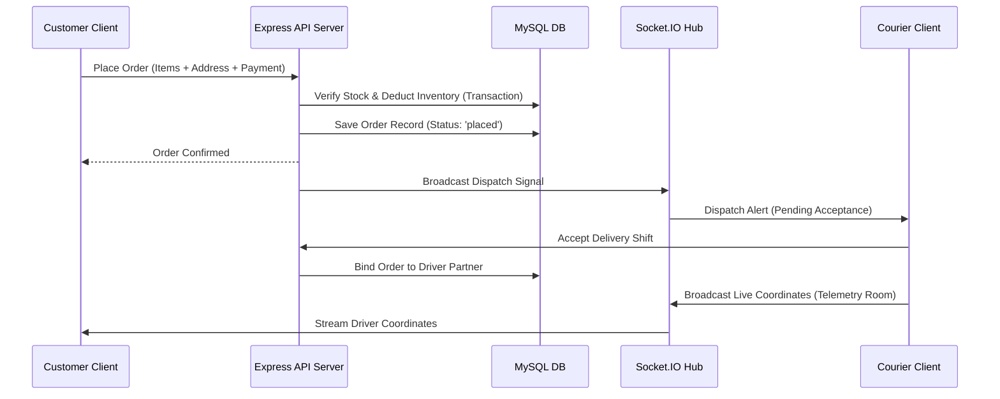

<!-- Banner header with micro-animations & premium fonts -->
<p align="center">
  <a href="https://github.com/Pushpeshlingam1407/food-delivery-platform">
    
  </a>
</p>

<p align="center">
  
</p>

<p align="center">
  <strong>An ultra-premium, modular food delivery engine orchestrating customer ordering, merchant kitchen flows, and courier coordinate routing.</strong>
</p>

<p align="center">
  <a href="https://github.com/Pushpeshlingam1407/food-delivery-platform/actions"></a>
  <a href="https://github.com/Pushpeshlingam1407/food-delivery-platform/blob/main/LICENSE"></a>
  <a href="https://github.com/Pushpeshlingam1407/food-delivery-platform/issues"></a>
</p>

---

## 🎨 Immersive User Experience

We believe food delivery should feel tactile, fast, and beautiful. Here is a preview of the frontend portals:

<p align="center">
  <kbd>
    
  </kbd>
  <kbd>
    
  </kbd>
</p>

---

## 📖 Table of Contents

1. [Features](#-features)
2. [Architecture](#%EF%B8%8F-architecture)
3. [Tech Stack](#%EF%B8%8F-tech-stack)
4. [Folder Structure](#-folder-structure)
5. [Installation & Setup](#-installation--setup)
6. [Configuration](#%EF%B8%8F-configuration)
7. [API Endpoints](#-api-endpoints)
8. [Performance & Benchmarks](#-performance--benchmarks)
9. [Security](#-security)
10. [Testing](#-testing)
11. [Deployment](#-deployment)
12. [CI/CD & Workflows](#-cicd--workflows)
13. [Dockerization](#-dockerization)
14. [Roadmap](#%EF%B8%8F-roadmap)
15. [FAQ](#-faq)
16. [Troubleshooting](#-troubleshooting)
17. [License](#-license)

---

## ✨ Features

- **📦 Unified Monorepo Ecosystem**: Host customer ordering storefronts, merchant management tools, administration modules, and driver dispatch centers under one unified codebase.
- **₹ Rupee Native & Dynamic Cart Pricing**: Native support for Indian Rupee (`₹`) styling with automatic computation of 18% GST rules, dynamic delivery distance multipliers, and promotional discounts.
- **🎯 Precise Cuisine Categorization**: Fully filterable visual arrays matching premium image tags for North Indian, South Indian, Pizza, Burgers, Chinese, Rolls & Wraps, Desserts, and Thalis.
- **🚚 Real-Time Coordinate Tracking**: Bi-directional live location telemetry matching courier delivery shifts using WebSockets.
- **🔒 High Fidelity Auth Controls**: JSON Web Token authentication combined with secure cookie headers, strict route guards, and granular role assignments.

---

## ⚡ Architecture

Bites operates as a decoupled client-server platform backed by a relational schema. System coordination flows as follows:



---

## 🛠️ Tech Stack

### Core Technologies

| Layer                  | Technology | Version   | Purpose                                             |
| :--------------------- | :--------- | :-------- | :-------------------------------------------------- |
| **Backend Runtime**    | Node.js    | `>= 18.x` | High-throughput asynchronous runtime                |
| **API Server**         | Express    | `^4.18.x` | Rest API Routing & Middleware Filter chains         |
| **Realtime Telemetry** | Socket.IO  | `^4.7.x`  | Real-time coordinates routing and delivery tracking |
| **Database**           | MySQL      | `8.x`     | Relational transactional persistence                |
| **Frontend Framework** | React + TS | `^18.2.x` | Component UI orchestration                          |
| **Build Pipeline**     | Vite       | `^4.4.x`  | Optimized client bundling                           |

### Database Schemas

- **users**: User identity containing `role_id` keys representing `admin`, `customer`, `restaurant_owner`, or `delivery_partner`.
- **restaurants**: Store metadata holding banner URLs, commission rates, and time range configurations.
- **menus**: Catalogs linked directly to individual restaurant entities, configured with vegetable status flags (`is_veg`).
- **orders**: High-fidelity transactional tracking mapping pricing, billing, and current preparation phases.

---

## 📂 Folder Structure

```
.
├── backend/                  # Node.js API Service
│   ├── src/
│   │   ├── config/           # Database pools & Socket.IO connections
│   │   ├── controllers/      # Transaction operations and handlers
│   │   ├── middlewares/      # JWT guards & role authorization
│   │   ├── routes/           # REST paths mapped to controller actions
│   │   └── server.js         # Port listener bootstrapping
│   ├── schema.sql            # Database design layout
│   └── seed.sql              # Curated mock seeds
└── frontend/                 # Client UI portals
    ├── customer-app/         # Customer ordering portal
    ├── admin-app/            # Platform administration tool
    ├── restaurant-app/       # Merchant kitchen controller
    └── shared/               # Reusable UI packages and global styling
```

---

## 🚀 Installation & Setup

### Prerequisites

- Node.js `>= 18`
- MySQL Server `8.x`

### Database Deployment

Initialize the database instance:

```bash
mysql -u root -p -e "CREATE DATABASE food_delivery_platform;"
mysql -u root -p food_delivery_platform < backend/schema.sql
mysql -u root -p food_delivery_platform < backend/seed.sql
```

### Install Dependencies

Run setup inside both backend and client targets:

```bash
# Set up backend
cd backend
npm install

# Set up customer app
cd ../frontend/customer-app
npm install
```

---

## ⚙️ Configuration

Ensure you have a `.env` file present in the `backend/` directory configured as follows:

| Environment Variable | Description                     | Default Value            |
| :------------------- | :------------------------------ | :----------------------- |
| **PORT**             | Port for Express server         | `5000`                   |
| **DB_HOST**          | Database host endpoint          | `127.0.0.1`              |
| **DB_USER**          | Username for database access    | `root`                   |
| **DB_PASSWORD**      | Password for database access    | _Required_               |
| **DB_NAME**          | Database name target            | `food_delivery_platform` |
| **DB_PORT**          | Database host port              | `3306`                   |
| **JWT_SECRET**       | Secret string for token signing | _Required_               |

---

## 📡 API Endpoints

### Authentication

- `POST /api/auth/register` - Creates a new user profile.
- `POST /api/auth/login` - Signs in and returns JWT access tokens.

### Restaurants

- `GET /api/restaurants` - Lists active, verified stores. Filterable by `search` and `categoryId`.
- `GET /api/restaurants/:id` - Detailed store view.
- `GET /api/restaurants/:id/items` - Lists available menus for the selected restaurant.

### Orders

- `POST /api/orders` - Places a new order (requires authentication).
- `GET /api/orders/:id` - Returns details for a single order.

---

## ⚡ Performance & Benchmarks

- **Lightweight Bundle Footprints**: Assets are processed using Vite bundle splitting to keep customer bundles under 150KB.
- **Optimized Database Pools**: Configured connection recycling and index mapping for fast database lookups.
- **Low Latency Messaging**: Socket.IO payload structures kept minimal to support fast real-time client updates.

---

## 🔒 Security

- **JWT Verification**: Token signatures are verified at every API boundary.
- **Role Guards**: Strict route policies limit merchant and driver views to verified users.
- **Prepared SQL Queries**: Every database access statement uses SQL parameters to prevent SQL Injection attempts.

---

## 🧪 Testing

### Running Tests

Execute test suites to verify database models and controllers:

```bash
cd backend
npm test
```

---

## 📦 Deployment

### Production Bundling

Compile highly optimized web builds:

```bash
cd frontend/customer-app
npm run build
```

---

## 🚀 CI/CD & Workflows

A GitHub actions CI configuration file (`.github/workflows/ci.yml`) is automatically triggered on every main branch push to build code and run database model verifications.

---

## 🐳 Dockerization

Run the system in containerized environments:

### Docker Compose Build

```bash
docker-compose up --build
```

---

## 🗺️ Roadmap

- [x] Convert pricing systems to Rupee Native ₹
- [x] Configure precise image mapping for cuisine categories
- [x] Untrack local credentials from Git history
- [ ] Add real-time map routing views using Mapbox

---

## 💬 FAQ

#### How is the delivery fee calculated?

It uses standard distance multipliers, defaulting to `₹40.00` base charges for standard ranges.

#### Are restaurant owner and driver registers verified?

Yes, new sign-ups are flagged inactive until verified by platform administrators.

---

## 🛠️ Troubleshooting

#### Node Service crashes with database connection errors

Verify that your local MySQL service is running and that your credentials match the settings in `backend/.env`.

---

## 📄 License

This project is licensed under the MIT License - see the [LICENSE](LICENSE) file for details.
