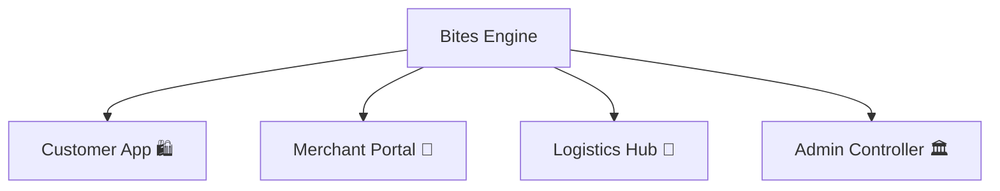

# 🍔 Bites — Premium Multi-Portal Food Delivery Engine

<p align="center">
  
</p>

## ✨ The Concept
Bites is a hyper-polished, modern, and micro-animated multi-portal food delivery ecosystem designed to orchestrate ordering, kitchen processing, and delivery partner shifts concurrently. It features curated, editorial designs tailored for beautiful dark-mode glassmorphism and smooth micro-animations.

---

## 🎨 Visual Identity & Premium Portals

Bites is split into four custom-crafted visual workflows:



### 🛍️ Customer Experience
A premium editorial interface with a warm dark-mode color scheme.
* **Curated Currencies**: Integrated full ₹ (Rupee) support across all cart and checkout workflows.
* **Smart Filter Strips**: Category filters for Chinese, South Indian, Burgers, Healthy Bowls, Rolls & Wraps, Desserts, and Thalis.
* **Live Orders Tracker**: Real-time status cards showing order preparation, pickup, and delivery tracking.

### 🍳 Merchant Portal
An elegant control center for restaurant owners to update menus, track dynamic pricing, and monitor real-time kitchen statuses.

### 🚚 Logistics Hub
An app for delivery partners to manage coordinates, check online shift statuses, and route customer drop-offs.

---

## 🚀 Tech Orchestration

- **Client Stack**: React, TypeScript, Vite, CSS variables, Lucide Icons, Glassmorphism design tokens.
- **Server Engine**: Node.js, Express, Socket.IO, MySQL connection pool.
- **Asset Sourcing**: Curated high-resolution Unsplash food photography presets.

---

## 🛠️ Quickstart

### 1. Database Setup
Ensure you have MySQL running. Create database `food_delivery_platform` and seed it:
```bash
mysql -u root -p -e "CREATE DATABASE food_delivery_platform;"
# Load schema and mock records
mysql -u root -p food_delivery_platform < backend/schema.sql
mysql -u root -p food_delivery_platform < backend/seed.sql
```

### 2. Ignition
To run the full workspace concurrently:

**Run Backend Engine:**
```bash
cd backend
npm install
npm run dev
```

**Run Frontend Portals:**
```bash
cd frontend/customer-app
npm install
npm run dev
```

<p align="center">
  
</p>
