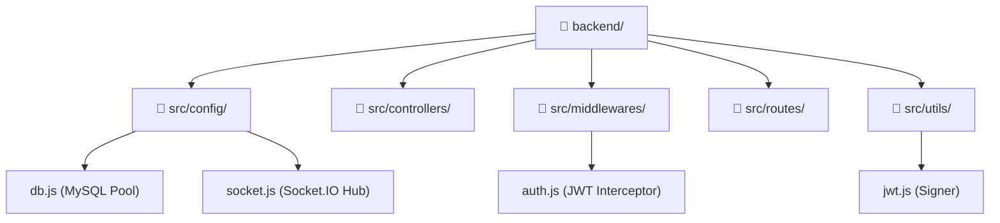

# 🗺️ Backend Reference Atlas & Architectural Novelty

This document provides a highly detailed, decorated file-by-file specification of the food-delivery-platform backend engine, mapping every code module, database layout, and runtime parameter.

---

## 📂 1. Directory Tree & Architecture

Below is the directory structural tree representing how the backend is laid out:

---

## 📄 2. File-by-File Reference (A-Z Catalog)

### ⚙️ Root Configuration Files

| File | Type | Description / Role |
| :--- | :--- | :--- |
| **`.env`** | Configuration | Environment variables (Database credentials, JWT keys, Port configuration). |
| **`package.json`** | Dependencies | List of npm modules, entry points, and startup/development scripts. |
| **`schema.sql`** | SQL Schema | Database architecture (34 relational tables, constraints, keys). |
| **`seed.sql`** | SQL Seed | Mock database record populations (users, default menus, and addresses). |

---

### 🚀 Bootstrapping Layer

* 🌐 **[server.js](file:///C:/Users/pushp/Desktop/food-delivery-platform/backend/src/server.js)**: Runs the HTTP port listener on `5000` and configures real-time socket connections.
* 🛡️ **[app.js](file:///C:/Users/pushp/Desktop/food-delivery-platform/backend/src/app.js)**: Mounts global Express filters (Helmet, Cors, JSON) and configures the `/api/*` feature routes.

---

### 🛠️ Infrastructure Configuration (`/src/config`)

* 🔌 **[db.js](file:///C:/Users/pushp/Desktop/food-delivery-platform/backend/src/config/db.js)**: Creates the asynchronous MySQL connection pool.
* 📡 **[socket.js](file:///C:/Users/pushp/Desktop/food-delivery-platform/backend/src/config/socket.js)**: Governs live updates, connection state recovery, and coordinate broadcast rooms.

---

### 🛡️ Security Filters (`/src/middlewares`)

* 🔑 **[auth.js](file:///C:/Users/pushp/Desktop/food-delivery-platform/backend/src/middlewares/auth.js)**: Validates bearer headers and routes auth errors via `401 Unauthorized` status codes.

---

### 🛣️ API Route Maps (`/src/routes`)

> [!NOTE]
> Routes register REST paths and attach security filters before running controller logic.

* 📍 **`addressRoutes.js`**: Customer shipping/billing address updates.
* 📊 **`adminRoutes.js`**: Revenue analytics, store verifications, settings, and coupons.
* 🔐 **`authRoutes.js`**: Registration, sign-in, token refresh, and OTP check.
* 🛒 **`cartRoutes.js`**: Basket management and pricing computation.
* 📝 **`cmsRoutes.js`**: Markdown publishing and document serving.
* 🚚 **`deliveryRoutes.js`**: Driver shifts and active coordinates tracking.
* 💖 **`favoriteRoutes.js`**: Saves favorite menu items for customers.
* 🔔 **`notificationRoutes.js`**: Pushes operational and delivery alerts.
* 📦 **`orderRoutes.js`**: Places orders and handles state transitions.
* 💳 **`paymentRoutes.js`**: Integrates Razorpay verification hooks.
* ⭐ **`ratingRoutes.js`**: Logs reviews and stars rating feedback.
* 💸 **`refundRoutes.js`**: Disputes wallet payout reversals.
* 📈 **`reportRoutes.js`**: Aggregates merchant sales and driver payouts.
* 🍴 **`restaurantRoutes.js`**: Manages merchant catalogs, categories, and opening hours.
* 💰 **`walletRoutes.js`**: Coordinates wallet deposits, balance checks, and payouts.

---

### 🧠 Transaction Handlers (`/src/controllers`)

> [!TIP]
> Controllers contain the core computational logic and execute transactions directly against the MySQL pool.

* 📍 **`addressController.js`**: Validates lat/long inputs and sets default user locations.
* 📊 **`adminController.js`**: Audits and approves restaurants; maps platform coupons.
* 🔐 **`authController.js`**: Verifies crypt hashes and joins profiles for `/me`.
* 🛒 **`cartController.js`**: Computes distance delivery fees and applies percentage or fixed coupons.
* 📝 **`cmsController.js`**: Stores Dynamic Markdown pages with custom SEO tags.
* 🚚 **`deliveryController.js`**: Records driver shift logs and active coordinates.
* 💖 **`favoriteController.js`**: Tracks liked items in the database.
* 📦 **`orderController.js`**: Deducts menu inventory and issues driver/merchant payout credits.
* 💳 **`paymentController.js`**: Processes digital signature verifications.
* 💸 **`refundController.js`**: Reverts captured order fees back into user wallets.
* 📈 **`reportController.js`**: Aggregates financial reports (Sales, Commissions).
* 💰 **`walletController.js`**: Handles deposits and processes withdrawal payouts.

---

## ✨ 3. Novelty and Special Features of This Project

Unlike standard template backends, this system is custom-tailored for multi-portal, high-concurrency food logistics:

### 🔄 1. Dual-Token Silent Handshake Interceptor Sync
> [!IMPORTANT]
> Prevents user session drops by signaling a standard `401 Unauthorized` for expired tokens, enabling clients to silently refresh security parameters via `/auth/refresh` without prompting login screens.

### 💰 2. Multi-Role Transaction Ledger Isolation
Uses MySQL isolation locks to guarantee database integrity across three roles:
1. **Customers**: Wallets are debited upon ordering.
2. **Merchants**: Receive net payout (Total minus Commission) immediately upon order completion.
3. **Drivers**: Earn delivery fees and tips credited to their account.

### 📡 3. Resilient WebSocket State Recovery
> [!TIP]
> Tuned `pingTimeout` parameter buffers connection drops during delivery transit. Reconnecting drivers automatically rejoin active tracking rooms to resume GPS coordinates broadcasts.
